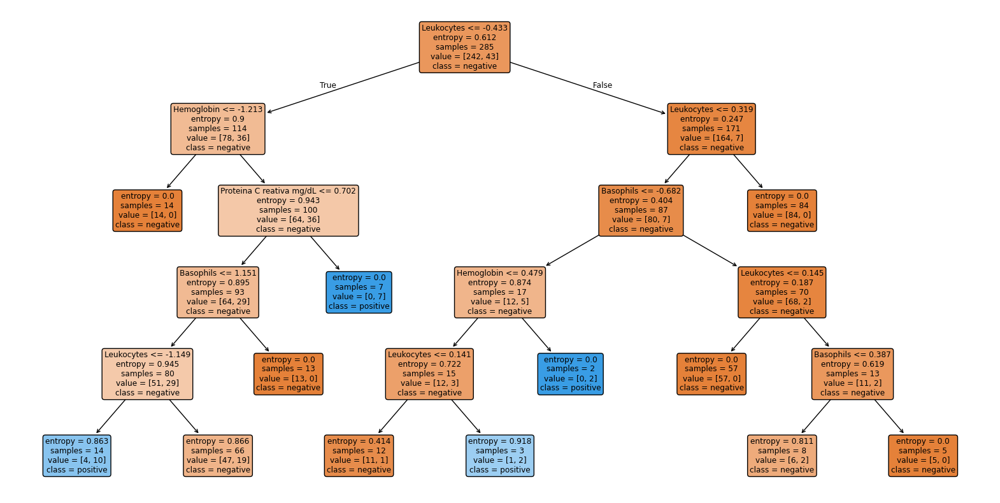
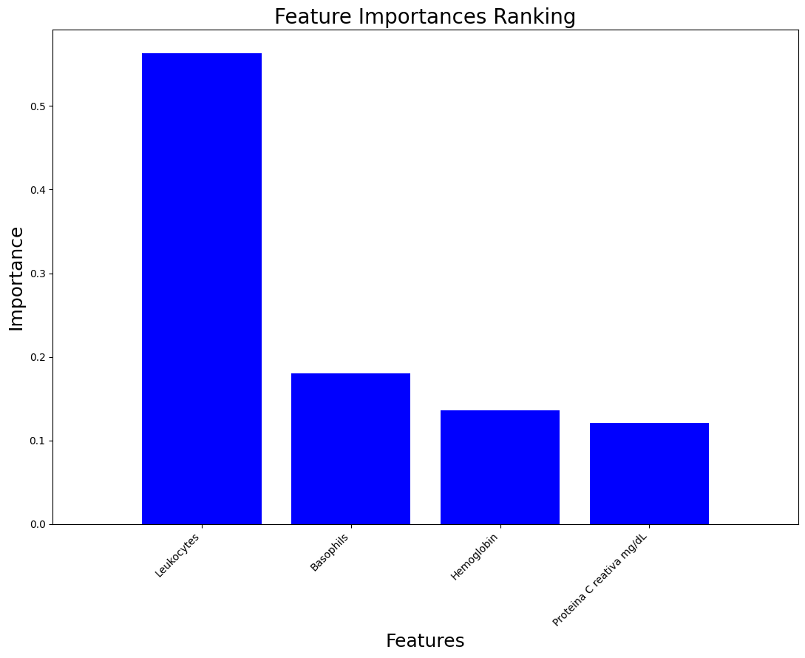
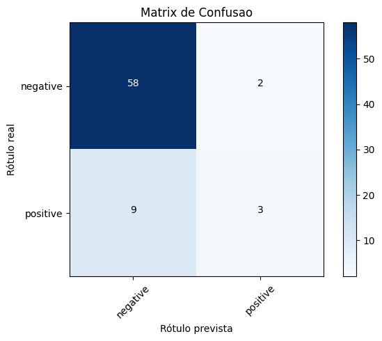

# SARS-Cov-2 Results

Aplicação de Árvore de Decisão (aprendizado supervisionado) para prever o resultado do exame de SARS-Cov-2 (positivo ou negativo), a partir de atributos laboratoriais do paciente: como leucócitos, hemoglobina, basófilos, proteína C reativa e creatinina.

## Árvore de Decisão

Modelo Preditivo em formato de estrutura hierárquica (árvore).

- Cada **nó interno** representa uma decisão baseada em uma feature.
- Cada **aresta** representa um resultado possíve dessa decisão.
- Cada **nó folha** representa uma predição final (**classe**).

Esse modelo é interpretável, sendo considerado um algoritmo do tipo **white-box**.

### Entropia

A **entropia** é uma medida da impureza/desordem em um conjunto de dados, e é usada para quantificar o quanto as classes estão misturadas em um nó. Se um nó contém amostras puras (ou seja, todas da mesma classe), a entropia é 0, por outro lado, se um nó contém uma divisão equilibrada (ex.: 1/2 positivo e 1/2 negativo), a entropia é máxima. Ela pode ser calculada por $H(s)$:

$$
H(S) = -p_1 \log_2(p_1) - p_2 \log_2(p_2)
$$

Onde:

- $p_1$ é a proporção de exemplos da classe 1 (ex: positivos)
- $p_2$ é a proporção de exemplos da classe 2 (ex: negativos)

### Treinamento

Durante o treinamento, o algoritmo precisa decidir em quais atributos fazer os splits, para isso o critério é encontrar o atributo que **mais reduz a entropia**. O algoritmo segue as seguintes etapas:

1. Cálculo da Entropia do conjunto atual.
2. Simula divisões para cada atributo com base em limiares (ex.: `Hemoglobin <=0.5`)
3. Calcula a entropia **ponderada** das divisões
4. Calcula o **ganho de informação**: $G = H(s_0) - H(s_1)$

- $H(s_0)$ : Entropia antes do split
- $H(s_1)$ : Entropia depois do split

5. Escolhe o atributo com maior ganho de informação, ou seja, a divisão que melhor organiza os dados.

## Resultado do Modelo: predict SARS-Cov2

A imagem abaixo exibe a árvore de decisão gerada (modelo). Cada nó contém:

1. Feature e valor de corte
2. Entropia (quanto menor mais puro o nó)
3. Número de amostras
4. Distribuição das classes (negative / positive)
5. Classe predita (maioria das amostras)



### Interpretando a Avaliação do Modelo

- **Precisão**: das classificações que o modelo fez para uma determinada classe, quantas efetivamente eram corretas?
- **Recall**: dos possíveis datapoints pertecentes a uma classe, quantos o modelo conseguiu classificar corretamente?

```
                precision    recall  f1-score   support

    negative       0.87      0.97      0.91        60
    positive       0.60      0.25      0.35        12

    accuracy                           0.85        72
   macro avg       0.73      0.61      0.63        72
weighted avg       0.82      0.85      0.82        72
```

- **Acurácia**: proporção de previsões corretas entre todas as previsões feitas. Neste caso, o modelo acertou 84,7% das previsões no total.
- No entanto, a acurácia pode ser enganosa quando há um desbalanceamento entre as classes (como foi o caso). Embora a acurácia alta, há uma presença considerável de "falsos positivos" (ex.: `recall positive: 0.25`)

<div style="display: flex;">
  
  
</div>

- Verdadeiros Negativos (TN) = 58 : casos que realmente eram negativos e o modelo previu corretamente como negativos.
- Falsos Positivos (FP) = 2 : casos que eram negativos, mas o modelo errou e previu como positivo.
- Falsos Negativos (FN) = 9 : casos que eram realmente positivos, mas o modelo errou e previu como negativos.
- Verdadeiros Positivos (TP) = 3 : casos positivos, corretamente identificados
